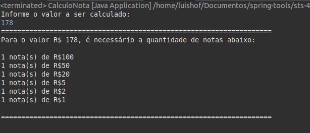
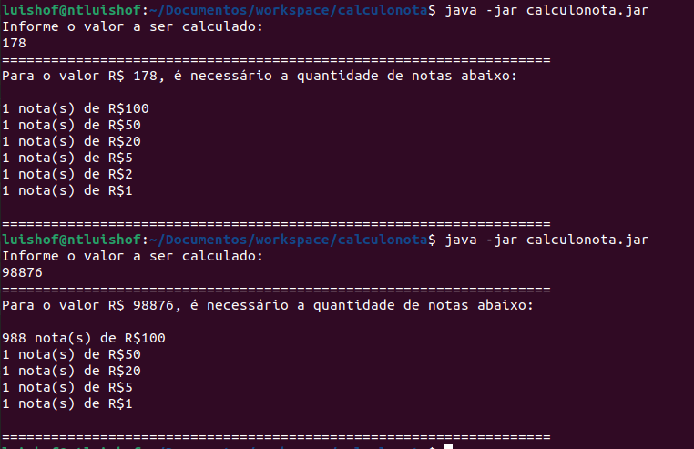

# Calculo do menor número de notas possíveis

Faça um algoritmo que receba um valor inteiro e calcule o menor número de notas possíveis (cédulas) no qual o valor pode ser decomposto. As notas consideradas são de 100, 50, 20, 10, 5, 2 e 1. A seguir, o programa apresenta a relação de notas necessárias.

<h3> Desafio realizado no Spring Tool Suite </h3>

Linguagem utilizada Java.

Moeda de Referencia: Real (Brasil)  :brazil:

Realizado a exportação do pacote java.

Para execução **java -jar  calculonota.jar**

